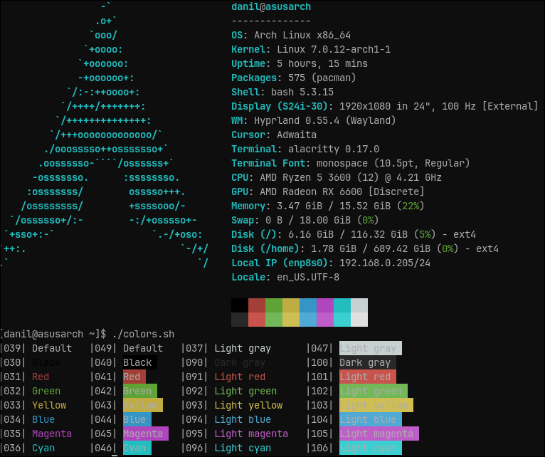
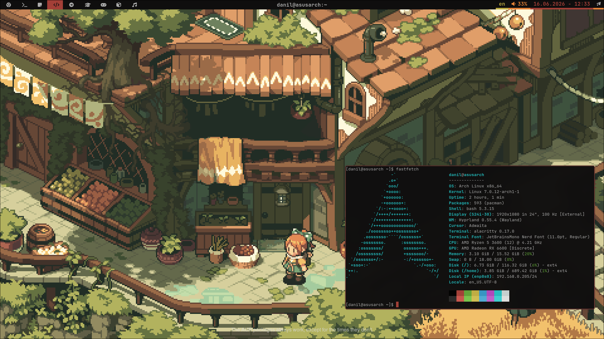

# Muted Comfort Theme

A modern, muted, and eye-friendly color scheme for Alacritty. Inspired by the cozy philosophy of **Gruvbox** and **Everforest**, but rebuilt on a deep, rich pitch-black background (`#0f0e0e`) for a sleeker, more contemporary look.

[Русское описание ниже](#описание-на-русском)

---

## Preview




## Installation
---
The theme is installed via [hyprthemer](https://github.com/Lumanis45/hyprthemer#)
```bash
hyprthemer install Lumanis45/muted-comfort
```


## Описание на русском

Современная приглушенная цветовая схема для терминала Alacritty, созданная для максимального комфорта глаз. Вдохновлена уютом **Gruvbox** и **Everforest**, но перенесена на глубокий угольно-черный фон (`#0f0e0e`), что придает ей более строгий и актуальный вид.

---
## License
MIT © [ Rikichik ]

